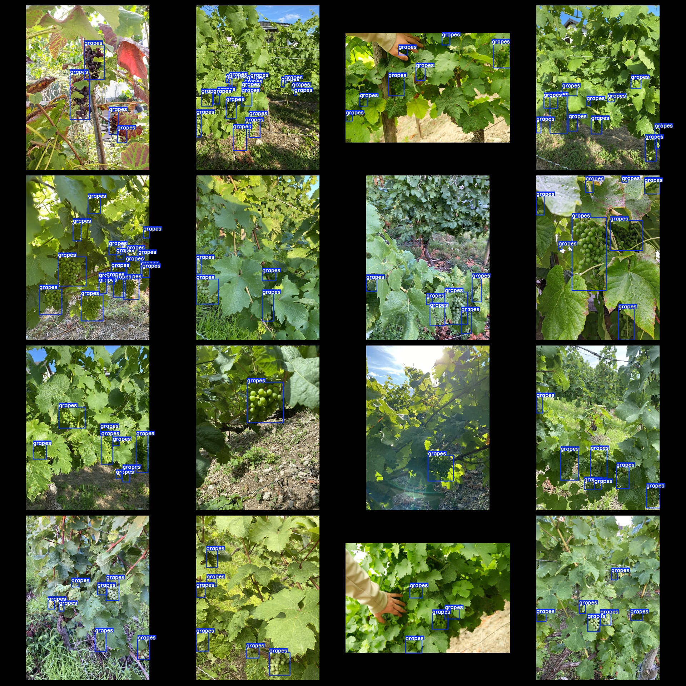
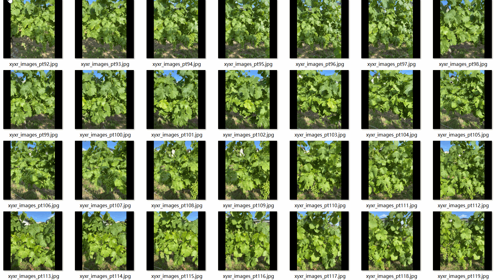

# Vineyard in Grape Dataset: 1076 Images in VOC+YOLO Format

The grapevine dataset consists of 1076 images in VOC+YOLO format. The dataset is organized into three folders for storage: JPEGImages, Annotations, and labels.

In the JPEGImages folder, there are a total of 1076 jpg images.

The Annotations folder contains a total of 1076 xml files.

Lastly, the labels folder contains a total of 1076 txt files.

There are a total of 1 label category: ["grapes"].

Each labeled category has a total of 6592 boxes (as per the yolo format's class order, which differs from this example).

The total number of boxes is 6592.

The resolution of the images is clear.

The images have not been enhanced.

The repository location for this dataset is datasets_sl.

The shape of the labels is rectangular, used for object detection recognition.

This dataset does not guarantee the accuracy or precision of any models trained on it or any weight files. It provides accurate and reasonable annotations only.

The details of the annotations and images are as follows:

## Images

---

Here is a pay link on Stripe (https://buy.stripe.com/3cs8yP7sY87d0vu9AB). Please contact me lonlonago@foxmail.com after funding $89, and I will send you a complete data files, thank you!

